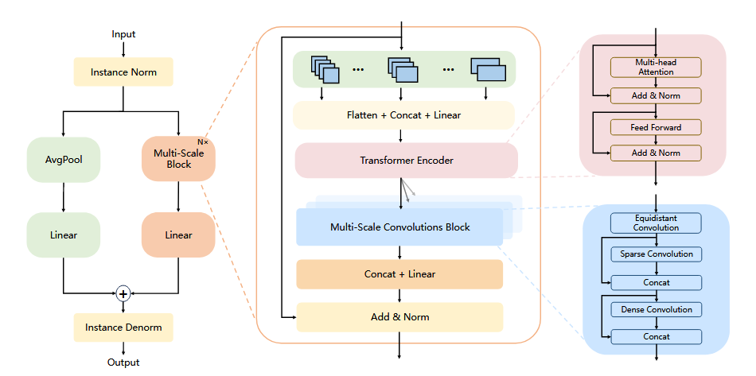
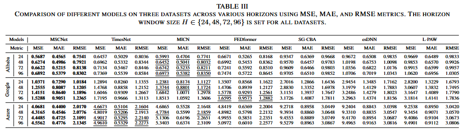
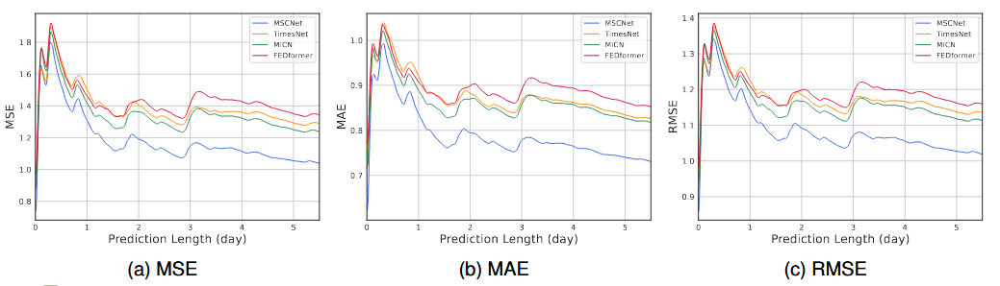
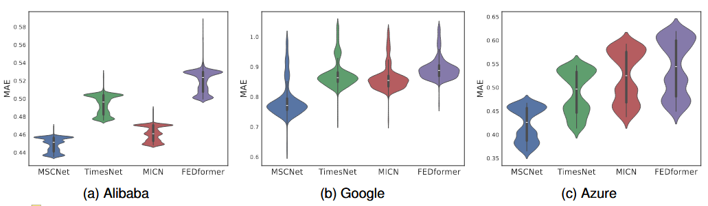
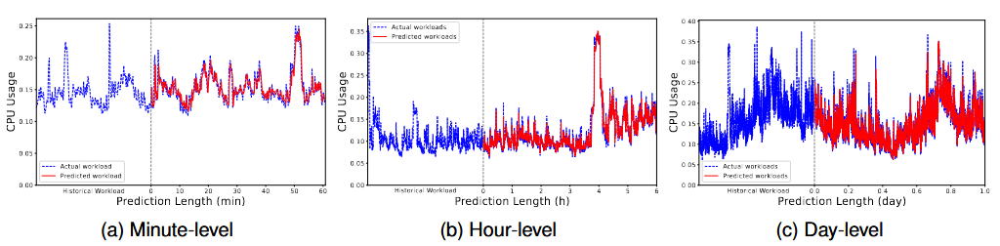
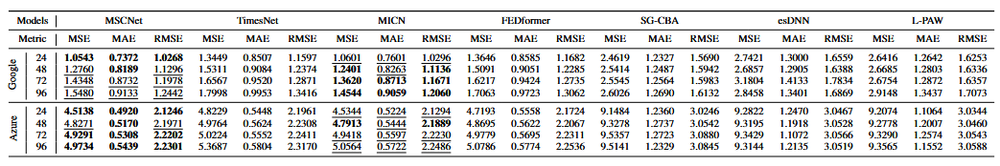

# MSCNet

---

Welcome to the official repository of the MSCNet paper: "[MSCNet: Multi-Scale Network with Convolutions  for Long-term Cloud Workload Prediction](https://ieeexplore.ieee.org/abstract/document/10858411)"

## Introduction

---

MSCNet is a method designed for accurate long-term cloud workload prediction. It primarily consists of the Trend Prediction Block and the Multi-Scale Prediction Block.The Trend Prediction Block is mainly used to extract trend information from highly fluctuating cloud workloads.The Multi-Scale Prediction Block is composed of three submodules: the Multi-Scale Patch Block, the Transformer Encoder, and the Multi-Scale Convolutions Block. It performs multi-scale modeling of cloud workloads to capture their periodicity and long-term dependencies.Additionally, MSCNet incorporates reversible instance normalization and a channel-independent strategy to mitigate the impact of data distribution shifts on model performance. By integrating the Trend Prediction Block and the Multi-Scale Prediction Block, MSCNet achieves accurate predictions for long-term cloud workloads.



The proposed MSCNet significantly outperforms existing methods. It achieves the highest accuracy across all datasets under varying prediction windows for all three evaluation metrics, demonstrating its strong capability in modeling long-term dependencies and periodic patterns at multiple scales.



On the Google dataset, MSCNet achieves superior performance across all three metrics. Moreover, as the prediction horizon increases, the performance gap between our model and other baselines progressively widens, demonstrating its stronger capability for long-term cloud workload forecasting.



MSCNet achieves lower MAE than other models across different datasets, demonstrating its superior prediction accuracy.



MSCNet performs predictions on the Alibaba dataset across varying forecasting horizons, demonstrating effective performance at minute-level, hour-level, and day-level prediction scales.



MSCNet was trained on the Alibaba dataset and then directly applied to predict workloads on both Google and Azure datasets. The results demonstrate that MSCNet achieves higher prediction accuracy than other methods, showcasing its strong generalization capability and transferability.



## Getting Start

---

### Environment Requirements

To get started, ensure you have Conda installed on your system and follow these steps to set up the environment:

```cmd
conda create -n MSCNet python=3.8
conda activate MSCNet
pip install -r requirements.txt
```

### Data preparation

The Google datasets for MSCNet can be obtained from [Google-cluster-data](https://github.com/google/cluster-data) provided by Google. The Alibaba datasets for MSCNet can be obtained from [Alibaba-cluster-data](https://github.com/alibaba/clusterdata) provided by Alibaba Group. The Azure datasets for MSCNet can be obtained from [Azure-cluster-data](https://github.com/Azure/AzurePublicDataset) provided by Microsoft.Create a separate folder named `./dataset` and place all the CSV files in this directory. **Note**: Place the CSV files directly into this directory, such as "./dataset/alibaba.csv"

### Training Example

You can easily reproduce the results from the paper by running the provided script command. For instance, to reproduce the main results, execute the following command:

```cmd
sh run.sh
```

Similarly, you can specify separate scripts to run independent tasks, such as obtaining results on alibaba:

```cmd
sh scripts/alibaba.sh
```

